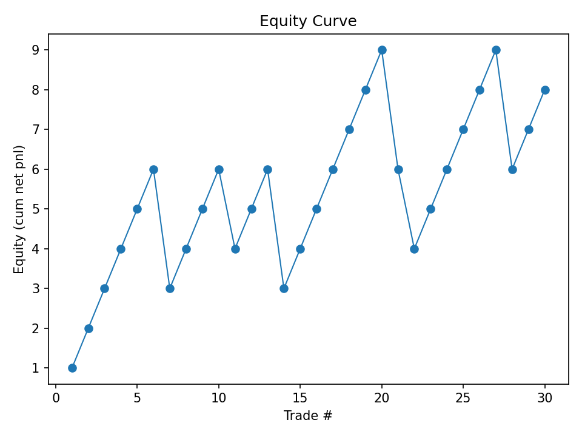
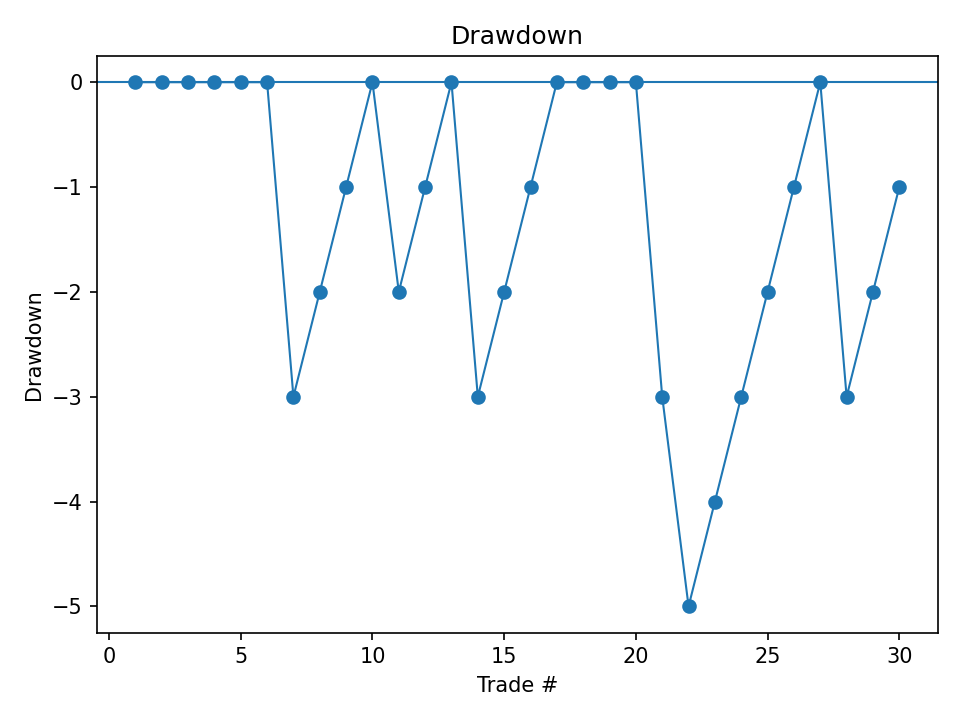

# Systematic Strategy Research (Crypto)

Reproducible research project that pulls crypto market data, stores it in Postgres,  
builds a feature dataset, and evaluates trading signals/backtests.


## Tech Stack
- Python 3.12
- Postgres (Docker)
- SQLAlchemy
- Ruff + Pytest
- Matplotlib (reporting)
- GitHub Actions CI

## Quickstart (Local Dev)
From the repo root:
```bash
docker compose up -d db adminer
python3 -m venv .venv
source .venv/bin/activate
pip install -r requirements.txt
pip install -r requirements-dev.txt
python -m src.main
```

## Step 1: Data Layer MVP
Goal: stand up a repeatable local data layer (Postgres in Docker) with a minimal OHLCV schema.

What this delivers:
- Dockerized Postgres + optional Adminer UI
- A base schema for instruments + OHLCV bars
- A connectivity smoke test you can run any time

Run:
```bash
docker compose up -d db adminer

docker compose exec -T db psql -U ssrl -d ssrl < sql/001_schema.sql

docker compose exec db psql -U ssrl -d ssrl -c "\dt"
docker compose exec db psql -U ssrl -d ssrl -c "SELECT 1 AS db_ok;"
```

Expected core tables:
- `instruments`
- `ohlcv_bars`
- `ingest_runs`

---

## Step 2: Data Ingestion + Resampling
Goal: ingest reproducible OHLCV into Postgres and create at least one higher timeframe via causal resampling.

What this delivers:
- Sample ingestion pipeline into `ohlcv_bars`
- A higher timeframe (e.g., 4h) created from lower timeframe bars
- Sanity checks for duplicates, ordering, and counts

Run:
```bash
python scripts/ingest_sample_ohlcv.py

docker compose exec db psql -U ssrl -d ssrl -c "
SELECT i.exchange, i.symbol, b.timeframe, COUNT(*) bars,
       MIN(b.ts) AS first_ts, MAX(b.ts) AS last_ts
FROM ohlcv_bars b
JOIN instruments i ON i.instrument_id=b.instrument_id
GROUP BY 1,2,3
ORDER BY bars DESC;
"

# example resample SQL
docker compose exec -T db psql -U ssrl -d ssrl < sql/003_resample_4h.sql

docker compose exec db psql -U ssrl -d ssrl -c "
SELECT timeframe, COUNT(*) AS bars
FROM ohlcv_bars
GROUP BY timeframe
ORDER BY timeframe;
"
```

---

## Step 3: Feature Engineering Pipeline
Goal: define a normalized feature store, compute causal indicators, and persist feature values back to Postgres.

What this delivers:
- Feature definitions table + long-form feature values keyed by `(instrument_id, timeframe, ts, feature_id)`
- Core indicator implementations that avoid lookahead
- Unit + integration tests for correctness

Run:
```bash
# create feature-store schema
docker compose exec -T db psql -U ssrl -d ssrl < sql/002_features.sql

docker compose exec db psql -U ssrl -d ssrl -c "\dt"

# compute + upsert features (example)
python scripts/build_features.py --exchange binance --symbol BTCUSDT --timeframe 1h

docker compose exec db psql -U ssrl -d ssrl -c "
SELECT COUNT(*) AS n_features FROM features;
SELECT COUNT(*) AS n_feature_values FROM bar_feature_values;
"

# tests
pytest -q -m "not integration"
pytest -q -m integration
```

---

## Step 4: Strategy + Backtest
Goal: implement a realistic v1 backtest loop (limit orders + bracket exits), add costs/metrics, and produce reproducible exports.

Strategy (v1):
- Trend filter (1h): `EMA50 > EMA200`
- Entry (10m): close crosses above VWAP (optional volume confirmation)
- Limit order simulation:
  - place next bar after signal
  - fill rule: `low <= limit_px <= high`
  - expire after N bars
- Exits: ATR-based stop + R-multiple take profit + optional time stop

Outputs:
- `data/outputs/trades.csv`
- `data/outputs/summary.json`

Run (smoke):
```bash
python scripts/run_backtest_smoke.py
python scripts/make_report.py
python scripts/run_walkforward_smoke.py
```

---

## Step 5: Costs + Realism Layer (Config-Driven)
Goal: apply fees + slippage realistically, make costs reproducible via config, and run a quick sensitivity test (e.g., 2× costs).

What this delivers:
- Config-driven maker/taker fees + slippage (bps)
- Sensitivity runner that produces 1.0× and 2.0× outputs

Run:
```bash
python scripts/run_backtest_smoke.py --config configs/v1.yaml
python scripts/make_report.py
```

Expected outputs:
- `data/outputs/trades.csv`, `data/outputs/summary.json` (kept for compatibility)
- `data/outputs/trades_1.0x.csv`, `data/outputs/summary_1.0x.json`
- `data/outputs/trades_2.0x.csv`, `data/outputs/summary_2.0x.json`
- `data/outputs/cost_sensitivity.json`

Repo hygiene:
- Generated files under `data/outputs/` are ignored via `.gitignore` (folder kept with `data/outputs/.gitkeep`).

---

## Step 6: Walk-Forward Evaluation (A/B/C) on Real Data
Goal: run an A/B/C walk-forward loop on real DB data: optimize on Train (A), select on Validate (B), and report out-of-sample performance on Test (C).

What this delivers:
- Loads BTCUSDT bars + features from Postgres
- Performs an A/B/C split and parameter sweep
- Selects best params on Validate (B) and evaluates on Test (C)

Run:
```bash
# ensure DB is running
docker compose up -d db

# walk-forward on real DB data
PYTHONPATH="$(pwd)" python scripts/run_step6_real_db.py --config configs/v1.yaml
```

Outputs:
- `data/outputs/step6_real_runs.csv`
- `data/outputs/step6_real_best.json`

---

## Step 7: Reporting + Exports
Goal: turn a backtest run into artifacts (CSV + plots) with a stable, repeatable output layout.

What this delivers:
- Per-run report folder with:
  - `equity.csv`
  - `equity_curve.png`
  - `drawdown.png`
  - `manifest.json` (summary + artifact pointers)
- Cost sensitivity reporting via filename prefixes

Run (from real backtest outputs):
```bash
PYTHONPATH="$(pwd)" python scripts/run_step7_report.py \
  --trades data/outputs/trades.csv \
  --out-dir reports/runs/step7_smoke

PYTHONPATH="$(pwd)" python scripts/run_step7_report.py \
  --trades data/outputs/trades_1.0x.csv --prefix 1.0x --out-dir reports/runs/cost_sensitivity

PYTHONPATH="$(pwd)" python scripts/run_step7_report.py \
  --trades data/outputs/trades_2.0x.csv --prefix 2.0x --out-dir reports/runs/cost_sensitivity
```

### Demo report (deterministic)
To guarantee a visible equity + drawdown curve even when a small sample produces few trades, this repo includes a deterministic demo generator:

```bash
PYTHONPATH="$(pwd)" python scripts/run_step7_demo_report.py
```

Example output (committed):






---

## Step 8: Tests (Indicators + Fill Model + No-Lookahead)
Goal: add focused unit tests for core indicators and the limit-order fill model, plus a no-lookahead proof via truncation equivalence.

What this delivers:
- Indicator unit tests (EMA / ATR / rolling VWAP) on tiny deterministic inputs
- Limit-order fill-model tests (fills, no-fill, expiry, idempotence)
- No-lookahead test: running the engine on a truncated dataset matches the prefix of a full run
- Clean unit vs integration split via `@pytest.mark.integration` + `pytest.ini`

Run:
```bash
ruff check .
pytest -q

# unit-only (CI default)
pytest -q -m "not integration"

# integration-only (requires DB)
pytest -q -m integration
```

Added/updated tests:
- `tests/test_indicators_unit.py`
- `tests/test_fill_model.py`
- `tests/test_no_lookahead_truncation.py`


---

## Step 9: Optional C++ Module (pybind11) — Fast EMA
Goal: accelerate one performance-critical indicator in C++, keep a safe Python fallback, and verify exact-match behavior with tests.

What this delivers:
- C++ extension module via pybind11: `_fast_indicators` (compiled at install time)
- Python wrapper with automatic fallback: `src/fast_indicators.ema()`
- Unit tests that lock correctness vs a reference implementation
- CI builds and tests the extension on macOS + Linux (unit tests only)

How it works:
- The compiled module is named `_fast_indicators` to avoid name collisions with the Python package.
- The public API lives in `src/fast_indicators/__init__.py` and prefers the C++ path when available.

Run:
```bash
# install (builds the extension)
pip install -e ".[dev]"

# quick check
python -c "import numpy as np; from src.fast_indicators import ema; print(ema(np.array([1.,2.,3.]), 3))"

# tests
pytest -q
```

Key files:
- `cpp/indicators.cpp` (C++ implementation)
- `cpp/CMakeLists.txt` (build config)
- `src/fast_indicators/__init__.py` (fallback wrapper)
- `tests/test_fast_indicators.py` (correctness tests)

---

## CI + Developer Workflow
- Lint: `ruff check .` and `ruff format .`
- Unit tests: `pytest -q -m "not integration"`
- Integration tests (DB): `pytest -q -m integration`

GitHub Actions runs Ruff + unit tests on every push/PR via `.github/workflows/ci.yml`.  
Integration tests are marked with `@pytest.mark.integration` and are not run in CI by default.